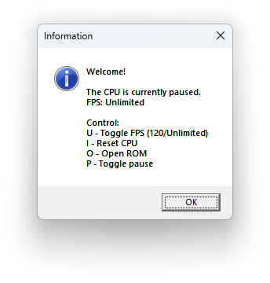

# Chip-8

🇷🇺 [Доступно на русском](README-RUS.md)

## Thanks to
- http://devernay.free.fr/hacks/chip8/C8TECH10.HTM
- https://github.com/Timendus/chip8-test-suite
- http://tinyfiledialogs.sourceforge.net
- https://github.com/kripod/chip8-roms
- https://johnearnest.github.io/chip8Archive

## Usage
1. **Download, extract and run the latest version. Close the information window.**
    

2. **Press `O` key and select ROM file to boot.**
    

3. **Enjoy your program.**
    

4. **By pressing `P` you can pause the emulator.**
    

5. **`U` will limit the speed of the emulator by setting the maximum FPS to 120. Pressing it again will remove the limitation.**

6. **`I` will reset the Chip-8 state. This includes clearing RAM, resetting registers and loading a program from ROM**

## Issues
- **Doesn't pass tests**
    - [Display wait](https://github.com/Timendus/chip8-test-suite?tab=readme-ov-file#quirks-test)
    - [0xFx0A get key](https://github.com/Timendus/chip8-test-suite?tab=readme-ov-file#3-fx0a-getkey)

## Implemented instruction set
- [x] `00E0` **CLS**
- [x] `00EE` **RET**
- [x] `1nnn` **JP nnn**
- [x] `2nnn` **CALL nnn**
- [x] `3xkk` **SE Vx, kk**
- [x] `4xkk` **SNE Vx, kk**
- [x] `5xy0` **SE Vx, Vy**
- [x] `6xkk` **LD Vx, kk**
- [x] `7xkk` **ADD Vx, kk**
- [x] `8xy0` **LD Vx, Vy**
- [x] `8xy1` **OR Vx, Vy**
- [x] `8xy2` **AND Vx, Vy**
- [x] `8xy3` **XOR Vx, Vy**
- [x] `8xy4` **ADD Vx, Vy**
- [x] `8xy5` **SUB Vx, Vy**
- [x] `8xy6` **SHR Vx, Vy**
- [x] `8xy7` **SUBN Vx, Vy**
- [x] `8xyE` **SHL Vx, Vy**
- [x] `9xy0` **SNE Vx, Vy**
- [x] `Annn` **LD I, nnn**
- [x] `Bnnn` **JP V0, nnn**
- [x] `Cxkk` **RND Vx, kk**
- [x] `Dxyn` **DRW Vx, Vy, n**
- [x] `Ex9E` **SKP Vx**
- [x] `ExA1` **SKNP Vx**
- [x] `Fx07` **LD Vx, DT**
- [x] `Fx0A` **LD Vx, K**
- [x] `Fx15` **LD DT, Vx**
- [x] `Fx18` **LD ST, Vx**
- [x] `Fx1E` **ADD I, Vx**
- [x] `Fx29` **LD F, Vx**
- [x] `Fx33` **LD B, Vx**
- [x] `Fx55` **LD [I], Vx**
- [x] `Fx65` **LD Vx, [I]**
